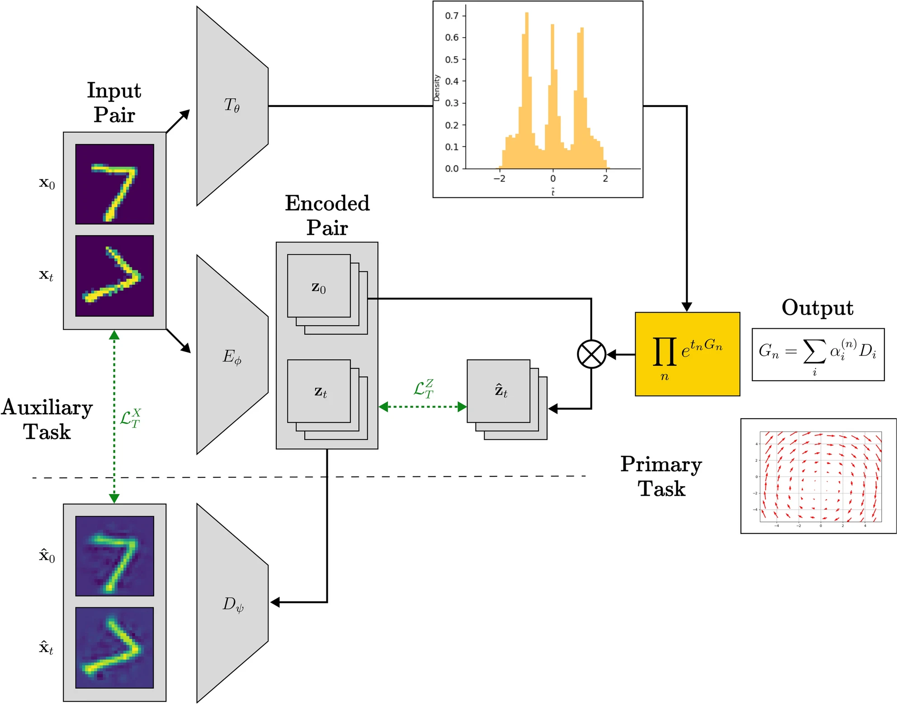

# Cartan: Neural Symmetry Detector with Latent Lie Algebras

Cartan is a framework for unsupervised neural symmetry detection using PyTorch. It leverages an encoder–decoder style architecture to (1) determine a symmetry generator and (2) estimate transformation magnitude distributions in order to find geometric relationships in data. This is done by feeding the model pairs of data samples, between which one expects there to be a relationship (a linear mapping $e^{t\mathbf{G}}$) that is shared amongst samples through a fixed generator $\mathbf{G}$ but is sample-specific in magnitude $t$ (e.g., rotation vs. the specific angle of rotation). The exponential map is performed in the latent space and linked to estimates of the pixel-level transformation by introducing an $\alpha$-matching term in the loss. 

The task, recovering both the generator and the distribution of magnitudes for arbitrary transformations, applied to MNIST and the [Galaxy10 DECaLS](https://astronn.readthedocs.io/en/latest/galaxy10.html) datasets is refered to as SyMNIST and GalaxSym respectively. When the pairs stem from seperate root images, the task gets the 'Super' prefix, yielding SuperSyMNIST and SuperGalaxSym (e.g., two different handwritten 3s, but one of them is rotated by an arbitrary amount). It supports MNIST or Galaxy10 grayscale images out-of-the-box.

<p align="center">
  <picture>
    <source srcset="docs/cartan_arch.webp" type="image/webp">
    
  </picture>
</p>

See our paper for more details: https://www.nature.com/articles/s41598-025-17098-8

**Gabel, A.**, Quax, R. & Gavves, E., "Type-II Neural Symmetry Detection with Lie Theory," *Scientific Reports*, **15**, 33500 (2025). https://doi.org/10.1038/s41598-025-17098-8

## Overview
### Model
- `EncoderLieTDecoder` is the primary architecture: an encoder produces a latent pair, a symmetry generator is parameterized using a basis `D`, and a t-network predicts magnitudes of the transformation. The magnitudes are multiplied by the normalized generator and exponentiated before decoding back to the image space. The figure above highlights this pipeline.
- Latent representations can be patch-based (default) or vector-based via `EncoderLieMulTVecDecoder`—choose the variant by swapping the `arch` section in your config.
- Cartan builds on Lie-group symmetry learning ideas introduced in [1] and the symmetry-discovery framework of [2]. A first prototype of this approach was presented in [3].

### Quick Start
- Install dependencies: `pip install -r requirements.txt`
- Prepare data under `data/` (MNIST auto-downloads; Galaxy10 paths provided in configs)
- Train: `python train.py -c config.json`
- Outputs (checkpoints, logs, TensorBoard traces) are written to `saved/`.

### Configuration
- Edit `config.json` (or pass CLI overrides) to set architecture, data loader, and regularisation weights.
- Handy CLI overrides:
  - Learning rate: `--lr 1e-3`
  - Batch size: `--bs 512`
  - Latent dimension (patch): `--L 25`
  - Run name: `--n cartan_run`
- Switch to latent-vector mode by pointing `arch.type` to `EncoderLieMulTVecDecoder` and using `config_vec.json` as a template.

### Experiment Automation & Evaluation Scripts
- `train.sh` – quick sweep runner for a single set of hyperparameters.
- `test.py` – minimal baseline metric evaluation on held-out data.
- `test_tze.py`, `test_tze_plots.py` – richer diagnostics that log generator histograms, transformation grids, etc.
- Results are stored under `images/` for quick inspection.

## Additional Resources
- `sct.ipynb` – demonstrates special conformal transforms on MNIST, useful for stress-testing non-affine behaviour.
- `time_complexity.py` – benchmarks different matrix-exponential routines (`torch.matrix_exp`, truncated series, custom approximations).

### Cite
You can cite our work using the following snippet:
```
@article{Gabel2025,
  author    = {Gabel, Alex and Quax, Rick and Gavves, Efstratios},
  title     = {Type-II Neural Symmetry Detection with Lie Theory},
  journal   = {Scientific Reports},
  year      = {2025},
  volume    = {15},
  pages     = {33500},
  doi       = {10.1038/s41598-025-17098-8},
  url       = {https://doi.org/10.1038/s41598-025-17098-8},
  issn      = {2045-2322}
}
```

## References
[1] R. Rao and D. Ruderman, “Learning Lie Groups for Invariant Visual Perception,” *Advances in Neural Information Processing Systems*, **11**, 1998. https://proceedings.neurips.cc/paper_files/paper/1998/file/277281aada22045c03945dcb2ca6f2ec-Paper.pdf

[2] N. Dehmamy, R. Walters, Y. Liu, D. Wang, and R. Yu, “Automatic Symmetry Discovery with Lie Algebra Convolutional Networks,” *Advances in Neural Information Processing Systems*, **34**, pp. 2503–2515, 2021. https://proceedings.neurips.cc/paper/2021/file/148148d62be67e0916a833931bd32b26-Paper.pdf

[3] **A. Gabel**, V. Klein, R. Valperga, J. S. W. Lamb, K. Webster, R. Quax, and E. Gavves, “Learning Lie Group Symmetry Transformations with Neural Networks,” *TAG-ML Workshop*, PMLR 221:50–59, 2023. https://proceedings.mlr.press/v221/gabel23a.html

## Acknowledgments
- My gratitude goes out to Riccardo Valperga, Victoria Klein, Max van Spengler, Samuele Papa, and David Knigge for helping out with this project.
- Training/testing loop logic, config parsing, logging utilities, and data-loader scaffolding are adapted from the PyTorch Template by Victor Huang: https://github.com/victoresque/pytorch-template/tree/master. Those portions retain the original MIT license; see `LICENSE` for details.
